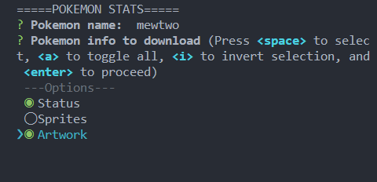
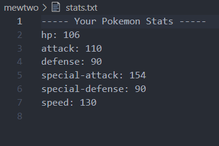
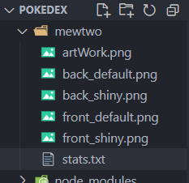

# Pokedex

Welcome to the Pokedex repository! This project is a Command Line Interface (CLI) tool that allows users to fetch Pokemon data from the PokeAPI and generate reports based on their preferences.

## Features

1) Fetch Pokemon data: Seamlessly interact with the PokeAPI to retrieve comprehensive information about various Pokemon species.

2) Download artwork and sprites: Select your favorite Pokemon and effortlessly download their stunning artwork and sprite images.

3) Check Pokemon status: Get real-time information on a Pokemon's stats, including their strengths, weaknesses, and other vital attributes.


## Getting Started

### Prerequisites

To run the Pokedex CLI, make sure you have the following installed on your system:

- Node.js (version 12 or higher)
- npm (Node Package Manager)

### Installation

1. Clone the repository to your local machine:

```
git clone https://github.com/Abhisheksingh734/MyPokedex.git
```

2. Change to the project directory:

```
cd MyPokedex
```

3. Install the necessary dependencies:
```
npm install
```

### Usage

1. Start the Pokedex CLI by running the following command:
```
npm start
```

2. Follow the prompts to enter the name of the Pokemon you want to fetch data for and select the desired information to download.

3. The tool will fetch the data from the PokeAPI and save it locally based on your chosen options.

4. Once the process is complete, the CLI will generate a report with the downloaded data.


## Screenshots
### CLI Interface


### Stats Report


### Pokemon Artwork


### Fetched Data


<hr>

## Contributing

Contributions are welcome! If you want to contribute to the Pokedex project, please follow these steps:

1. Fork the repository.
2. Create a new branch for your feature or bug fix

```
git checkout -b feature/your-feature-name
```
3. Make your modifications and commit your changes:

```
git commit -m "Add your commit message here"
```

4. Push your branch to your forked repository:

```
git push origin feature/your-feature-name
```

5. Open a pull request in the main repository, explaining your changes and providing any necessary details.


6. Feel free to modify and customize this README file to fit your project's specific details, guidelines, and any additional information you want to provide to users.

## Acknowledgements

#### The Pokedex CLI project would not be possible without the contributions and support of the following:

[PokeAPI](https://pokeapi.co/) : The RESTful API used to fetch Pokemon data.

## License

This project is licensed under the MIT License.


